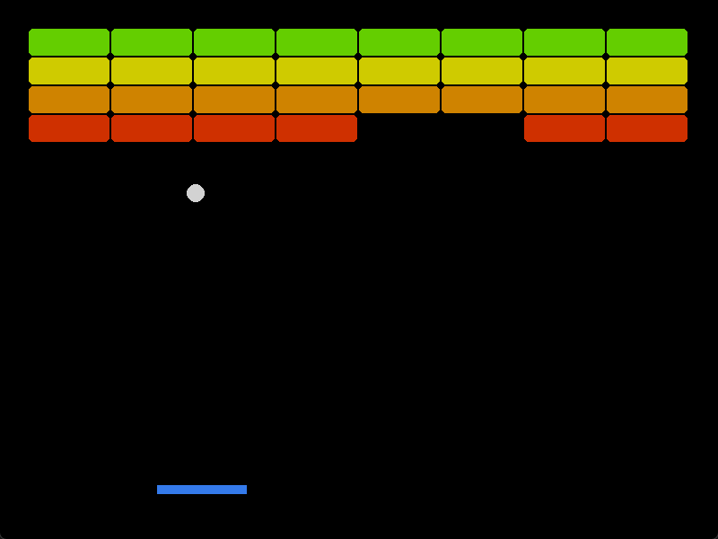

    
    

 
 

# 📖 INDEX  
 * 📥 [Installation guide](https://github.com/paolomalgarin/DigitML/blob/main/docs/README%20-%20Stuff/Documentation/INSTALLATION-OPTIONS.md)
 * 📌 [Project overview](#-project-overview)  
 * 🛠️ [Technologies used](#%EF%B8%8F-technologies-used)  
 * 📷 [Gui example](#-gui-example)   
 * 📄 [Licence](#-licence)  

 
 
 

# 📌 Project Overview

This repository contains a complete re-creation of Atari’s Breakout game, enhanced with an AI agent evolved via NEAT (NeuroEvolution of Augmenting Topologies). The project demonstrates how neuroevolution can be applied to train an agent to play (and eventually master) the game from scratch.
> [!TIP]
> [Installation guide](https://github.com/paolomalgarin/DigitML/blob/main/docs/README%20-%20Stuff/Documentation/INSTALLATION-OPTIONS.md)

 

---
 

# 🛠️ Technologies Used

  

- **Python**: ---  
- **Pygame**: ---  
- **NEAT-python**: ---

 

---
 

# 📷 Gui Example  
> *Here’s a screenshot of the game in action:*

    

> [!WARNING]
> To try it yourself, follow the [installation guide](https://github.com/paolomalgarin/DigitML/blob/main/docs/README%20-%20Stuff/Documentation/INSTALLATION-OPTIONS.md).

 

---
 

# 📄 Licence
This project is released under [MIT License](https://github.com/paolomalgarin/DigitML/blob/main/LICENSE.txt).
