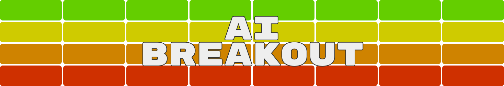

    
    

 
 

# 📖 INDEX  
 * 📥 [Installation guide](./installaion-guide/README.md)
 * 📌 [Project overview](#-project-overview)  
 * 🏗️ [Project structure](#%EF%B8%8F-project-structure)  
 * 🛠️ [Technologies used](#%EF%B8%8F-technologies-used)  
 * 🎮 [Game example](#-game-example)   
 * 📄 [Licence](#-licence)  

 
 
 

# 📌 Project Overview

This repository contains a complete re-creation of Atari’s Breakout game, enhanced with an AI agent evolved via NEAT (NeuroEvolution of Augmenting Topologies). The project demonstrates how neuroevolution can be applied to train an agent to play (and eventually master) the game from scratch.
> [!TIP]
> [Installation guide](./installaion-guide/README.md)

 

---
 

# 🏗️ Project Structure

 The project contains 4 main scripts inside the app folder:
- **train.py**: Trains NEAT and saves a genome that can beat the game inside `app\assets\genomes\` folder.
- **app.py**: Loads and tests the best genome.
- **algo.py**: Implements a non-AI algorithm to beat the game.
- **play.py**: Lets you play the game manually.

 

---
 

# 🛠️ Technologies Used

  

- **Python**  
- **Pygame**  
- **NEAT-python**

 

---
 

# 🎮 Game Example  
> *Here’s a screenshot of the game in action:*

    

> [!WARNING]
> To try it yourself, follow the [installation guide](./installaion-guide/README.md).

 

---
 

# 📄 Licence
This project is released under [MIT License](https://github.com/paolomalgarin/DigitML/blob/main/LICENSE.txt).
